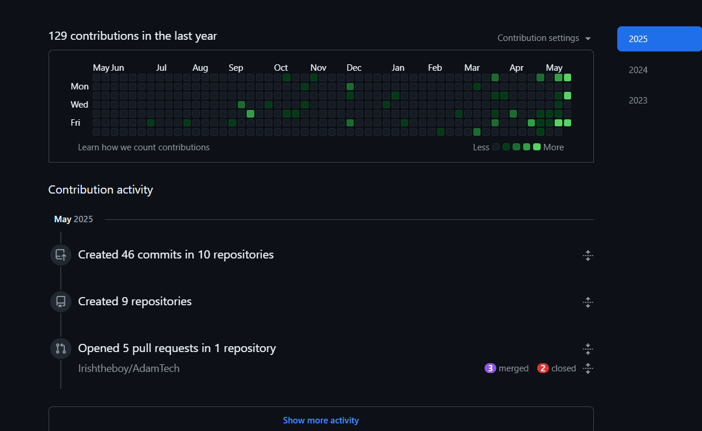
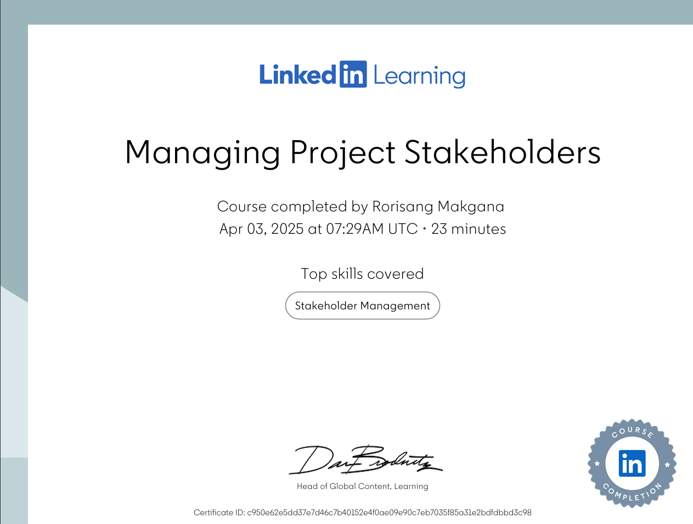
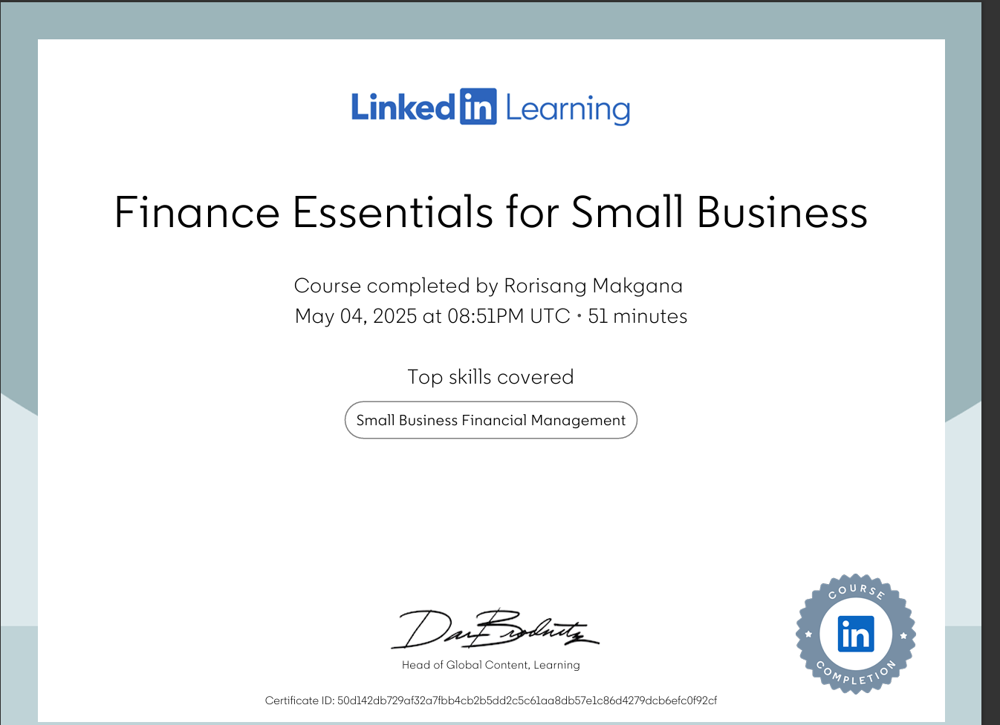

# PRP3-professional_practice--Skills_and_Interests

## ⚙️ 2. Skills and Interests

### 📂 Evidence
- GitHub contributions chart
- 
- Screenshots of badges from LinkedIn Learning
- 
- 
- [My Skills Matrix](#)

### 💭 Reflection (STAR)
**S**ituation:
> During the work readiness programme, we explored our technical and soft skills.  
**T**ask:
> I needed to identify and reflect on skills that align with my passions.  
**A**ction:
> I tracked my growth using a skills matrix and completed courses on UI/UX and JavaScript.  
**R**esult:
> I found I enjoy design-thinking and problem-solving through code — I'm now working on Flutter and JavaScript-based projects.

---
